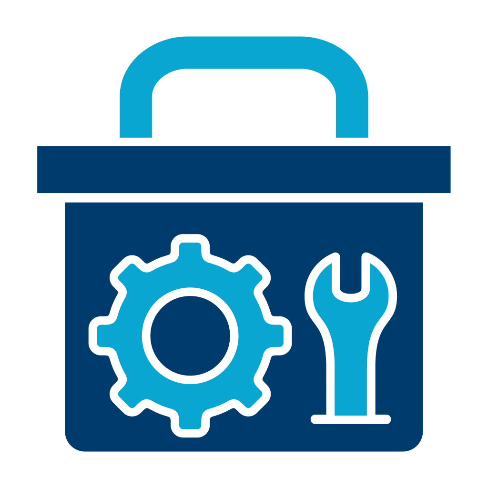

<p align="center">
  
</p>
<h1 align="center">DevBox</h1>
<p align="center"><b>Your whole local development stack, one click away.</b><br>
Runtimes · databases · web servers · <code>.test</code> domains · SSL · public sharing — one desktop app, zero containers.</p>

<p align="center">
  <a href="https://github.com/harungecit/DevBox/releases/latest"></a>
  <a href="LICENSE"></a>
  
  
</p>

<p align="center">
  <a href="https://github.com/harungecit/DevBox/releases/latest"><b>⬇ Download</b></a> ·
  <a href="https://devbox.harungecit.dev/">Website</a> ·
  <a href="#getting-started">Getting started</a> ·
  <a href="#what-you-get">What you get</a> ·
  <a href="#faq">FAQ</a>
</p>

---

## What is DevBox?

DevBox is a free, open-source desktop app that sets up and runs a complete local development environment for you. Instead of installing PHP here, Node there, fighting with PATH, editing the hosts file, and generating certificates by hand, you open DevBox and click **Install**.

Everything DevBox installs is the **real, native software** — official builds of the runtimes and services, running directly on your machine as normal processes. There is no Docker, no virtual machine, no wrapper layer. Your projects run exactly as they would in production, only faster to set up.

- **Runtimes:** Go · Node.js · PHP · Python · Rust — any version, several side by side
- **Web servers:** Nginx · Apache · Caddy · FrankenPHP
- **Databases & caches:** PostgreSQL · MySQL · MariaDB · MongoDB · Redis · Valkey
- **Tools:** Mailpit (catch outgoing mail), Adminer, Redis Commander and mongo-express (database UIs), Composer, npm/yarn/pnpm/Bun, uv/pipx/Poetry, air/golangci-lint/gopls, cargo-watch/cargo-edit/cargo-audit, mkcert, cloudflared
- **Projects:** `myapp.test` domains with trusted HTTPS, framework detection, one-click public URLs

Everything lives in a single folder (`C:\DevBox`), and DevBox sends no telemetry.

## Getting started

1. **Download** the installer from the [latest release](https://github.com/harungecit/DevBox/releases/latest) — `DevBox-Setup-<version>-windows-amd64.exe` — and run it.
   Windows SmartScreen may warn on first launch because the app is new; choose **More info → Run anyway**.
2. **Runtimes** → pick PHP, Node.js, Go, Python or Rust and click **Install**. The first version you install becomes the global one (it's put on your PATH automatically).
3. **Services** → install a web server (Nginx is a good default) and the database you need, then hit **Start**. Switch on **AUTO** to have them start together with DevBox.
4. **Projects** → **Add**: point to an existing folder, scaffold a new app from a template, or clone a Git repo. DevBox detects the framework, registers `your-project.test`, and issues a trusted certificate.
5. Open `https://your-project.test` in the browser. Done.

Need a public link for a client or a webhook? Click the **share** icon on a project — you get a `*.trycloudflare.com` URL in seconds. Link your Cloudflare account in **Settings** to use your own domain instead.

Full walkthrough with screenshots: <https://devbox.harungecit.dev/#usage>

## What you get

### Runtimes — Go, Node.js, PHP, Python, Rust… and 40+ more via plugins
- Install any version straight from the official sources (checksums verified). Version lists are cached and refreshed quietly in the background.
- Keep as many versions as you like. One is **global** (on your PATH); any project can be **pinned** to another one.
- Each PHP version gets its own FastCGI process, so a Laravel app on PHP 8.4 and a legacy app on 7.4 can run at the same time.
- **Batteries included:** PHP ships with a dev-tuned `php.ini` and common extensions enabled; Xdebug, Redis, Imagick, MongoDB and other PECL extensions are one click away. Composer, Bun, yarn and pnpm are installed for you.
- Minor/patch releases **update in place** — your `php.ini`, Composer, global npm and pip packages carry over.
- **More languages via plugins:** Java, .NET, Ruby, Deno, Bun, Dart, Flutter, Kotlin, Zig, Elixir, Erlang, Julia, Gradle, Maven, Terraform, kubectl and dozens more through the [vfox](https://vfox.dev) plugin registry — same install / pin / global workflow, and `JAVA_HOME`-style variables are managed for you. Add them from **Runtimes → Add runtime**.

### Services — Nginx, Apache, Caddy, FrankenPHP, PostgreSQL, MySQL, MariaDB, MongoDB, Redis, Valkey, Mailpit
- Choose a version and a port (conflicts are caught before install), then start, stop, restart, view logs and copy connection details — all from the UI.
- **MySQL and MariaDB — or Redis and Valkey — can run side by side** on different ports; installs and imports pick a free port automatically.
- Services keep running from the system tray until you quit DevBox; **AUTO** starts them at login.
- In-place updates keep your data, configs and vhosts. Major database upgrades are flagged, never forced.
- Mailpit catches every e-mail your app sends and shows it in a web inbox — no more accidental mails to real users.

### Already have it installed? Import it
- The **Import Center** ("Import from system" on the Runtimes and Services pages) scans your machine — PATH, Program Files, nvm, scoop, XAMPP, Laragon, WAMP, Homebrew — for runtimes and services installed outside DevBox.
- Importing manages the existing installation **in place**: nothing is moved or copied, DevBox just links to it (NTFS junction / symlink). Versions, PATH, per-project pinning and in-place updates work as if DevBox had installed it, and removing an import only removes the link.
- Imported services run with DevBox's own configuration and a fresh data directory on a free port; the original installation and its data stay untouched.

### Projects
- **Import** any folder, **scaffold** from a template (Laravel, Symfony, WordPress, CodeIgniter, Slim, CakePHP, Yii, Next.js, Nuxt, NestJS, Astro, SvelteKit, Vue, React, Svelte, Angular, Express, Django, Flask, FastAPI, Go, Gin, Rust, static…), or **clone** a repository.
- Framework auto-detection for 40+ frameworks — Laravel, Lumen, Symfony, CodeIgniter, Yii, CakePHP, Slim, Laminas, Drupal, WordPress, Joomla, Magento, PrestaShop, Next.js, Nuxt, NestJS, Astro, Remix, SvelteKit, Angular, Gatsby, Vue, React, Svelte, AdonisJS, Express, Fastify, Koa, Hono, Django, Flask, FastAPI, Goravel, Gin, Fiber, Echo, Actix, Axum, Rocket… — including each one's document root and dev-server command.
- Every project gets a **`.test` domain** (hosts file handled for you), a **trusted local certificate** via mkcert, and the right vhost for your chosen web server — nginx, Apache, Caddy or FrankenPHP.
- App-server frameworks (Next.js, Nuxt, Vite, Django, Go…) get a start/stop button with live logs, and the built-in front-door proxy routes their `.test` domain to the dev server.
- Pick the runtime version and web server per project; the PHP FastCGI instance and vhost are wired up automatically.
- **Terminal, ready to go:** one click opens your own terminal (Windows Terminal, PowerShell, Git Bash, iTerm…) in the project folder with the project's runtime version on PATH — or straight into `psql` / `mysql` / `redis-cli` connected to the DevBox service.

### Share to the internet
- **Quick tunnel:** one click, instant `https://*.trycloudflare.com` URL. Great for demos, mobile testing and webhooks.
- **Your own domain:** connect a Cloudflare API token once, then any project can be published as `app.yourdomain.com` — DNS record and tunnel route are created for you and restored on the next launch.
- Domain-bound settings (`APP_URL`, `NEXTAUTH_URL`, …) are served to your app per request, so local and public URLs work side by side.

### Quality of life
- English and Turkish UI, light/dark/system theme.
- Runs in the tray, starts at login (optionally minimized), closes to tray.
- In-app update check — new DevBox versions install from **Settings** in one click.
- Elevation (UAC) is asked only when strictly needed: writing the hosts file and binding port 80.

## Where things live

```
C:\DevBox\
├─ runtimes\{go,node,php,python,rust}\<version>\
├─ services\{nginx,postgres,mysql,...}\        # binaries, data, logs, generated configs
├─ projects\                                   # default home for scaffolded / cloned projects
├─ tools\{bun,mkcert,cloudflared,...}\
├─ ssl\certs\                                  # mkcert certificates
├─ logs\
└─ config.json · projects.json
```

Uninstalling DevBox leaves this folder — and your data — untouched.

## Platform support

| Platform | Status |
|---|---|
| Windows 10 / 11 (x64) | ✅ Supported — installer and portable zip on every release |
| macOS (Apple Silicon / Intel) | 🚧 Coming soon |
| Linux | Not planned for now |

## FAQ

**Is this Docker under the hood?** No. DevBox downloads the official binaries and runs them as native processes. Nothing is virtualised, and you can use the same binaries from your own terminal.

**Will it mess with my existing PHP/Node install?** DevBox only adds its own entries to your user PATH and keeps everything under `C:\DevBox`. Remove the entries or the folder and your system is as it was.

**Why does SmartScreen warn me?** DevBox is not yet signed with a paid code-signing certificate. Every release is built publicly by GitHub Actions from the tagged source and ships with a `SHA256SUMS` file you can verify.

**Does it phone home?** No telemetry. The only network requests are the downloads you trigger and the update/version checks — see the [privacy policy](https://devbox.harungecit.dev/privacy.html).

## Contributing

Bug reports, feature ideas and pull requests are welcome — open an [issue](https://github.com/harungecit/DevBox/issues) to get started. Developer notes live in [`CLAUDE.md`](CLAUDE.md).

## Acknowledgements

DevBox stands on the shoulders of great open-source projects: [Wails](https://wails.io), [Svelte](https://svelte.dev), [vfox](https://vfox.dev) and its plugin authors, [Caddy](https://caddyserver.com), [FrankenPHP](https://frankenphp.dev), [mkcert](https://github.com/FiloSottile/mkcert), [cloudflared](https://github.com/cloudflare/cloudflared), [Mailpit](https://mailpit.axllent.org), [Adminer](https://www.adminer.org), the PHP for Windows team, and every runtime, web server and database it installs for you. Thank you.

## License

[MIT](LICENSE) © 2026 [Harun Geçit](https://harungecit.dev)
